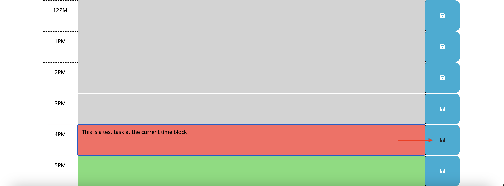

# Work Day Scheduler

## Description

This work day scheduler was created to utilize third-party APIs in JavaScript. It serves as a work day scheduler by displaying the current date at the top, followed by time blocks for each hour of the standard work day of 9am to 5pm. When a user clicks the save button, their task is saved to local storage. This means they can return to the site later, and their inputs will be saved. The current hour will be displayed in red, past hours in gray, and future hours in green. This project taught me how to use the third-party API, Day.js by implementing the current date and the color coding feature of the time blocks. I also used the jQuery library to traverse the DOM and select the HTML elements in the JavaScript. I wrapped all of my JavaScript in a call to jQuery so that the JavaScript runs only after everything in the DOM has loaded. This project also helped me practice making arrays with objects, for loops, if statements and event listeners for the save buttons.

## Installation

To deploy the work day scheduler, visit the project repository on GitHub > Settings > Pages > Source > Branch (main) > Save. From here you can view the finished project on GitHub Pages. You can view it via GitHub Pages here: https://camillebagnani.github.io/work-day-scheduler/

## Usage

To use this work day scheduler, click the empty box with the corresponding time of day for the task. Type the task and click the save button. This will save the task to the site's local storage so that you can access it later. If you want to add or update the task, simply type the new task and click the save button again. The color of the blocks will correspond with the current time. Blocks in the past will be gray, the block of the current time block will be red, and future time blocks will be green. 

## Credits

Starter code: https://github.com/coding-boot-camp/crispy-octo-meme

## License

n/a